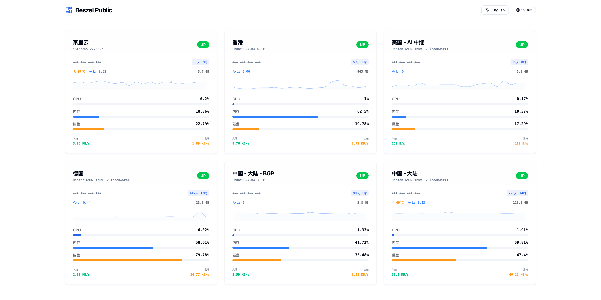
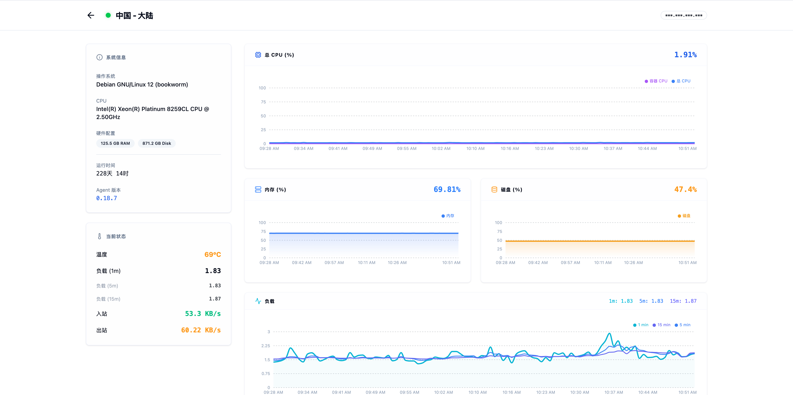
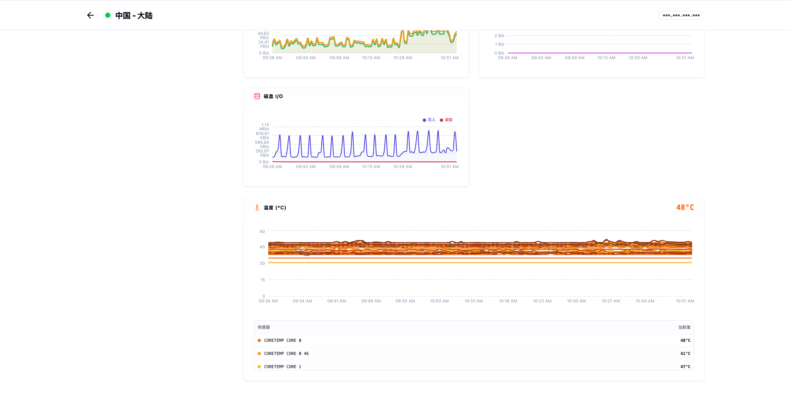

# Beszel Public Panel

---

## Screenshots

<p align="center">
  
</p>

<p align="center">
  
  
</p>

---

## Architecture

This project uses a **Dual-Service Architecture**:
1. **Frontend**: A React SPA that provides a fluid, low-latency monitoring experience.
2. **Backend Proxy**: A lightweight Node.js service that handles Beszel authentication and data sanitization. This prevents your admin/readonly password from being visible in the client-side code.

---

## Getting Started

### Prerequisites

- **Node.js**: v20.x.x or higher
- **Docker & Docker Compose**: (Optional, for easy deployment)
- **Beszel Account**: A read-only (recommended) or admin account from your Beszel instance.

### Option 1: Local Development

1. **Clone the Repo**
   ```bash
   git clone https://github.com/shawngao-org/beszel-public-panel.git
   cd beszel-public-panel
   ```

2. **Install Dependencies**
   ```bash
   npm install && cd server && npm install && cd ..
   ```

3. **Configure Environment**
   Create a `.env` file in the root directory (refer to `.env.example`).

4. **Launch**
   ```bash
   npm run dev
   ```
   *Frontend: http://localhost:5173 | Proxy: http://localhost:3001*

### Option 2: Docker Deployment (Recommended)

1. **Configure Environment**
   Edit `docker-compose-local.yml` and fill in your variables.

2. **Deploy**
   ```bash
   docker-compose -f docker-compose-local.yml up --build -d
   ```
   *Access your panel at http://localhost:3001*

---

## Environment Variables

| Variable | Description | Example |
| :--- | :--- | :--- |
| `VITE_PB_URL` | Your Beszel PocketBase URL | `https://beszel.yourdomain.com` |
| `VITE_PB_USER` | Beszel account email | `readonly@example.com` |
| `VITE_PB_PASS` | Beszel account password | `yourpassword123` |
| `VITE_API_URL` | Frontend link to the proxy | `http://localhost:3001` |
| `VITE_HIDE_IP` | Mask real server IPs (Privacy) | `true` (Recommended) |

---

## Contributing

Contributions are welcome! If you find a bug or have a feature request, please open an issue or submit a pull request.

## License

This project is licensed under the MIT License. See the [LICENSE](LICENSE) file for details.

## Acknowledgments

+ [Beszel](https://github.com/henrygd/beszel)
